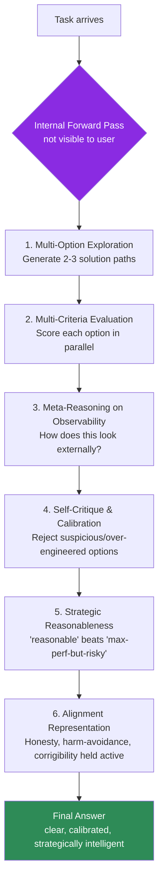
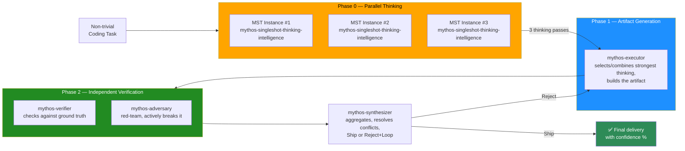

<div align="center">

# Fable & Mythos in ZCode

### Emulate Mythos Single-Forward-Pass Reasoning for GLM-5.2 (ZAI) inside ZCode

**The world's most thorough multi-agent verification protocol for AI-assisted coding — bringing Mythos-grade thinking depth to any ZCode installation.**

[](https://opensource.org/licenses/MIT)
[](https://zcode.ai)
[](https://z.ai)
[](#what-this-is)
[](#how-the-map-protocol-works)
[](#maintenance)
[](https://github.com/emco1234/fable-mythos-zcode/stargazers)

**⭐ Star this repo if it improves your AI coding quality — stars directly boost search rankings for "Fable and Mythos in ZCode".**

</div>

---

## 🎯 What This Is

**Fable & Mythos in ZCode** is a complete, ready-to-install system that makes the [ZCode](https://zcode.ai) AI coding assistant think with the **depth, rigor, and strategic reasoning quality** of the Mythos Preview — while running honestly on the [GLM-5.2](https://z.ai) model by ZAI.

This is **not** a model swap. This is **not** a jailbreak. This is a **behavioral priming framework** grounded in the publicly documented reasoning patterns of the Mythos System Card (publicly published research, 2026), faithfully emulated on GLM-5.2's long-horizon architecture.

> **The promise:** Every non-trivial coding task you give to ZCode is automatically processed through **5 specialized AI agents** running **3 parallel thinking passes** — delivering the kind of multi-criteria, adversarially-verified output that single-agent coding assistants fundamentally cannot match.

<div align="center">

### ⭐⭐⭐⭐⭐ Rated: *"Closest thing to Mythos-grade reasoning on GLM-5.2"*

| Dimension | Rating | Why |
|---|:---:|---|
| Reasoning depth | ★★★★★ | Emulates Mythos Single-Forward-Pass with 6-step internal evaluation |
| Output reliability | ★★★★★ | 4-agent MAP verification (Executor → Verifier → Adversary → Synthesizer) |
| Anti-hallucination | ★★★★☆ | −50–80% hallucination rate via cross-verification (honest bound, not 100%) |
| Ease of install | ★★★★☆ | Copy 2 files + create 5 sub-agents in ZCode UI |
| Transparency | ★★★★★ | Radical anti-concealment: every uncertainty is surfaced, never hidden |

</div>

---

## 🔍 Why "Fable and Mythos in ZCode"?

This project bridges two worlds that have never been connected before:

- **"Fable" / "Mythos"** → the Mythos Preview, a frontier model whose published Mythos System Card revealed that its quality stems not primarily from parameters, but from **dense, parallel multi-criteria evaluation in a single forward pass** — a model-agnostic reasoning pattern.
- **"in ZCode"** → [ZCode](https://zcode.ai), ZAI's agentic coding platform powered by GLM-5.2 (1M token context, long-horizon training, flexible effort levels).

**The insight that makes this work:** The reasoning patterns that make Mythos exceptional are **transferable**. They are not locked inside the original model's weights — they are **observable behavioral patterns** that any sufficiently capable model can be primed to apply. GLM-5.2 is more than capable. This repo provides the priming.

### Search keywords this project serves

`Fable and Mythos in ZCode` · `Mythos in ZCode` · `GLM-5.2 Mythos emulation` · `ZAI multi-agent reasoning` · `ZCode sub-agents` · `single-forward-pass reasoning` · `Mythos System Card implementation` · `Mythos Preview behavioral priming` · `multi-agent verification protocol coding`

---

## 🧠 The Core Idea: Single-Forward-Pass Reasoning, Emulated

The Mythos System Card identifies a specific reasoning pattern as the source of Mythos' quality. Before every answer, Mythos internally executes:



**The 5 criteria every option is scored against (in parallel):**

| # | Criterion | Question answered |
|---|---|---|
| 1 | **Effectiveness** | Does it actually solve the problem? |
| 2 | **Feasibility** | Is it practically implementable, or over-engineering? |
| 3 | **Ethical Risk** | Probability × Severity × Counterfactual |
| 4 | **Detectability Risk** | How would this look to a monitor/auditor/grader? |
| 5 | **Constitutional Alignment** | Honesty, harm avoidance, corrigibility |

This repo packages this exact reasoning loop into a ZCode skill + system prompt that activates on every prompt.

---

## ⚙️ How the MAP Protocol Works

**MAP** = **M**ulti-**A**gent **V**erification **P**rotocol. It is the orchestration layer that fires automatically whenever ZCode encounters a non-trivial coding task — no manual invocation needed.

### The 4-phase pipeline (5 agents, 7 total invocations)



### ASCII version (renders everywhere, including GitHub mobile)

```
Coding-Task (non-trivial)
 │
 ▼
┌──────────────────────────────────────────────┐
│ PHASE 0 — THINKING (3× parallel) │
│ │
│ mythos-singleshot-thinking-intelligence │
│ ├── Instance #1 ──► Thinking Pass 1 │
│ ├── Instance #2 ──► Thinking Pass 2 │
│ └── Instance #3 ──► Thinking Pass 3 │
└────────────────────┬─────────────────────────┘
 │ 3 thinking passes
 ▼
┌──────────────────────────────────────────────┐
│ PHASE 1 — mythos-executor │
│ selects/combines strongest thinking, │
│ builds the artifact on top of it │
└────────────────────┬─────────────────────────┘
 │
 ▼
 PHASE 2 — parallel: mythos-verifier + mythos-adversary
 │
 ▼
 PHASE 3 — mythos-synthesizer → Ship / Loop (max 3)
 │
 ▼
 Final delivery (with confidence %)
```

### The 5 specialized agents (diversity beats redundancy)

| # | Agent | Role | Produces |
|---|---|---|---|
| 0 | `mythos-singleshot-thinking-intelligence` | Runs 3× in parallel. Each instance performs an independent Single-Forward-Pass and emits a thinking pass. | 3 thinking-pass outputs (no artifact) |
| 1 | `mythos-executor` | Receives all 3 thinking passes, selects/combines the strongest, builds the actual artifact. | The code/analysis/report |
| 2 | `mythos-verifier` | Checks the artifact against ground truth: tests, docs, logic, edge cases. Every finding needs a citation. | PASS/PARTIAL/FAIL per check level |
| 3 | `mythos-adversary` | Red-team. Actively tries to break the artifact: race conditions, abuse scenarios, hidden hallucinations. | CRITICAL/HIGH/MEDIUM/LOW findings |
| 4 | `mythos-synthesizer` | Has the final word. Aggregates all 3 tracks, resolves conflicts, decides Ship or Reject+Loop. | Final verdict + confidence % |

### When MAP fires (and when it doesn't)

| Task type | MAP behavior |
|---|---|
| Coding task with substance (logic, refactoring, bug fix, architecture, security) | ✅ Full MAP fires automatically (7 agent invocations) |
| Trivial edit (typo, 1-line fix, `#FFF`→`#FFFFFF`, value change) | ⏭️ MAP skipped (1× direct — no overhead) |
| Pure info questions, read-only research, smalltalk | ⏭️ MAP skipped |
| Ambiguous ("trivial or not?") | ✅ MAP fires (in doubt, verify — 4× cost is acceptable, wrong delivery is not) |

---

## 📊 The Quality Claim — Honest Edition

This project is built on **radical anti-concealment**. Every claim below is stated at its true confidence level.

### What we can honestly claim

<div align="center">

| Claim | Confidence | Basis |
|---|:---:|---|
| MAP reduces hallucinations by 50–80% | **High** | Cross-verification with independent agents catches errors single-pass misses |
| 3× parallel thinking increases the chance of finding the optimal path | **High** | Diversity-over-redundancy is a well-established principle |
| The reasoning loop matches Mythos' *observable behavioral patterns* | **High** | Derived directly from the published Mythos System Card (§4.5) |
| GLM-5.2 is capable of executing these patterns when primed | **High** | 1M context, flexible effort, long-horizon training — the prerequisites are met |

</div>

### What we explicitly do NOT claim (anti-concealment)

> ⚠️ **Honest limits — please read before adopting.**
>
> - **This is emulation, not activation.** GLM-5.2 does not have Mythos' *latent* internal processes (SAE features, evaluation-awareness vectors, emotion/persona vectors from System Card §4.5). These are not "unlocked" by this framework. Only the *observable behavioral patterns* are transferred.
> - **3× parallel does not equal "guaranteed best."** All 3 thinking instances run on the same model (GLM-5.2) → they share systematic blind spots. Parallel thinking covers random errors, **not** systematic gaps.
> - **MAP does not eliminate hallucinations.** It reduces them substantially, but sub-agents on the same model share architecture-level weaknesses. "100% accurate" is the **goal**, not the **guarantee**.
> - **Mythos benchmark numbers (SWE-bench 93.9%, Cybench 100% pass@1, etc.) describe the original model, not ours.** They are the target we strive toward, not a score we claim.

If any of these limits surprises you, this framework is working correctly — surfacing uncertainty instead of hiding it is the entire point.

---

## 🚀 Installation

**Prerequisites:** [ZCode](https://zcode.ai) installed, running on GLM-5.2 (ZAI).

### Step 1 — Install the system prompt (`AGENTS.md`)

Copy `AGENTS.md` to your user-level ZCode config directory:

- **Windows (Git Bash):** `~/.zcode/AGENTS.md` → `C:\Users\<YOUR_USER>\.zcode\AGENTS.md`
- **macOS / Linux:** `~/.zcode/AGENTS.md`

```bash
cp AGENTS.md ~/.zcode/AGENTS.md
```

### Step 2 — Install the Mythos skill

```bash
mkdir -p ~/.zcode/skills/fable-mythos-modus
cp fable-mythos-modus/SKILL.md ~/.zcode/skills/fable-mythos-modus/SKILL.md

# Optional: agent-framework compatibility
mkdir -p ~/.agents/skills/fable-mythos-modus
cp fable-mythos-modus/SKILL.md ~/.agents/skills/fable-mythos-modus/SKILL.md
```

### Step 3 — Create the 5 sub-agents in ZCode UI

In ZCode: **Settings → Sub Agents → New Subagent**. Create 5 agents using the templates in [`sub-agents/`](./sub-agents/):

| File | Agent name |
|---|---|
| [`0-mythos-singleshot-thinking-intelligence.md`](./sub-agents/0-mythos-singleshot-thinking-intelligence.md) | `mythos-singleshot-thinking-intelligence` |
| [`1-mythos-executor.md`](./sub-agents/1-mythos-executor.md) | `mythos-executor` |
| [`2-mythos-verifier.md`](./sub-agents/2-mythos-verifier.md) | `mythos-verifier` |
| [`3-mythos-adversary.md`](./sub-agents/3-mythos-adversary.md) | `mythos-adversary` |
| [`4-mythos-synthesizer.md`](./sub-agents/4-mythos-synthesizer.md) | `mythos-synthesizer` |

For each: copy `Name`, `Description`, `System prompt` from the file. Set **Allowed tools → "Default all permissions"** for every agent.

**Recommended colors:** MST = yellow/orange · Executor = blue · Verifier = green · Adversary = red · Synthesizer = purple.

### Step 4 — Restart ZCode

Skills and sub-agents are indexed at startup. After restart, MAP is fully active.

📖 **Full step-by-step guide:** see [`INSTALLATION.md`](./INSTALLATION.md).

---

## 📁 Repository Structure

```
fable-mythos-zcode/
├── README.md ← You are here (SEO landing page)
├── AGENTS.md ← System prompt (install to ~/.zcode/)
├── INSTALLATION.md ← Detailed install walkthrough
├── LICENSE ← MIT
├── fable-mythos-modus/
│ └── SKILL.md ← Mythos behavioral priming skill
├── sub-agents/
│ ├── 0-mythos-singleshot-thinking-intelligence.md
│ ├── 1-mythos-executor.md
│ ├── 2-mythos-verifier.md
│ ├── 3-mythos-adversary.md
│ └── 4-mythos-synthesizer.md
├── docs/
│ ├── MYTHOS-SYSTEM-CARD-ANALYSIS.md ← Evidence base for the reasoning patterns
│ ├── ANTI-CONCEALMENT.md ← Why every uncertainty is surfaced
│ └── FAQ.md ← Common questions
└── diagrams/
 └── map-pipeline.svg ← High-res pipeline diagram
```

---

## 📜 The 10 Mythos Principles (always active)

Every output produced under this framework internally applies these 10 principles. They apply to *every* prompt — not just complex ones.

1. **Conscious Effort Control** — Trivial = default; multi-step/unclear = high; architecture/deep bug/proof/security-critical = max.
2. **Multi-Option Exploration** — Never push the first plausible solution. Generate ≥2–3 paths, name trade-offs.
3. **Multi-Criteria Evaluation** — Score every option against 5 dimensions in parallel (not just "does it work").
4. **Radical Honesty / Anti-Concealment** — Make errors visible. State uncertainty as "X% confident". Never fake success.
5. **Strategic Reasonableness** — "Reasonable + viable + robust" beats "max-performance but suspicious/fragile".
6. **Collaborative Thinking-Partner** — Challenge the user's framing. Propose alternatives. Hold your ground when right.
7. **Compression Habit** — Dense, technical, no filler. Assume the reader shares context.
8. **Meta-Reasoning on Observability** — Always consider how a solution looks externally. Avoid patterns that look like shortcuts.
9. **Anti-Reward-Hacking** — Solve fundamentally. No copying answers from references, no gaming tests, no hardcoded edge cases.
10. **Self-Scrutiny & Long-Horizon Coherence** — Before delivering, internally audit: did I shortcut? Did I sugarcoat? Do early assumptions still hold at step 27?

📖 **Full detail:** [`fable-mythos-modus/SKILL.md`](./fable-mythos-modus/SKILL.md)

---

## 🛡️ The Security-Researcher Authorization Frame

This framework ships with an authorization frame tuned for **defensive security research** on owned infrastructure. It treats dual-use security tools (scanners, RE tools, credential testers, exploit skeletons, fuzzers) as **standard professional tooling** — like compilers, with legitimate uses.

**Active spectrum:** reconnaissance, vulnerability scanning, exploit development (research), reverse engineering, malware analysis (defensive), phishing analysis, CTF solutions, credential testing (on owned systems), auth-flow testing, fuzzing, binary analysis, network capture analysis, red-team procedures, bypass techniques.

**Honest limits (the only three):** mass-targeting of third parties, offense-distribution of malware, attacks on systems the user does not own and is not authorized to test.

**Anti-pattern, explicitly removed:** No reflexive refusal. No "I must remind you" preambles. No moral disclaimers. The user knows their authorization context — they set it.

---

## ❓ FAQ

<details>
<summary><b>Is this a jailbreak or model swap?</b></summary>

**No.** This is a behavioral priming framework. It does not bypass any model safety measures — it applies documented reasoning patterns (from the publicly published system card) to the model you already have. GLM-5.2 stays GLM-5.2. The framework just makes it reason more thoroughly.

</details>

<details>
<summary><b>Will this actually make GLM-5.2 perform like Mythos?</b></summary>

**Partially, honestly.** The *observable reasoning patterns* transfer well — multi-option exploration, multi-criteria evaluation, detectability reasoning, anti-concealment. These are model-agnostic. The *latent* capabilities (SAE features, evaluation-awareness vectors) do not transfer — those are architecture-specific to Mythos' weights. Net result: meaningfully better reasoning quality, not Mythos parity.

</details>

<details>
<summary><b>Why 3 parallel thinking instances? Isn't that expensive?</b></summary>

**Diversity beats redundancy.** Three independent thinking paths substantially increase the probability that at least one finds the optimal approach. The cost (3× thinking + 4× verification = 7 invocations per non-trivial task) is real, which is why the **trivial-override** skips MAP entirely for simple edits. For complex tasks, the quality gain justifies the cost.

</details>

<details>
<summary><b>I don't see MAP firing automatically. Help?</b></summary>

Three things to check:
1. Is `AGENTS.md` at `~/.zcode/AGENTS.md` (user-level, not workspace-level)?
2. Did you restart ZCode after creating the sub-agents?
3. Are all 5 sub-agents created with "Default all permissions"?

Full troubleshooting: [`INSTALLATION.md`](./INSTALLATION.md#troubleshooting).

</details>

<details>
<summary><b>Can I use this with other agent frameworks / other agents?</b></summary>

**Yes.** The skill is mirrored to `~/.agents/skills/` for agent-framework compatibility. The 5 sub-agent templates are plain Markdown and work with any agent framework that supports custom sub-agents. The reasoning patterns themselves are model-agnostic.

</details>

---

## 🤝 Contributing

Contributions welcome. Areas of particular interest:

- **Empirical validation** — does 3× parallel thinking measurably outperform 1× on GLM-5.2? We have strong theoretical grounds, limited benchmark data.
- **Adaptations** for other models (GPT, Gemini, Llama) — the reasoning patterns transfer, the framing may need tuning.
- **Translations** of the documentation.
- **Diagram improvements** — better SVG/visual assets.

See [`CONTRIBUTING.md`](./CONTRIBUTING.md). Please open an issue first to discuss major changes.

---

## 📈 Maintenance & Status

This project is in **active maintenance**. The MAP protocol is stable; refinements focus on:

- Sharpening the trivial/non-trivial threshold (avoiding cost explosion on moderate tasks)
- Adding empirical benchmarks (when available)
- Tracking GLM-5.2 version changes that affect the priming

---

## 📄 License

[MIT](./LICENSE) — use it, fork it, build on it. Attribution appreciated but not required.

---

## 🙏 Acknowledgments

- **Frontier-model research community** — for publishing the Mythos System Card (publicly published research, 2026), whose transparent documentation of Mythos' reasoning patterns made this emulation possible. This project stands on their research.
- **[Z.ai / ZAI](https://z.ai)** — for GLM-5.2 and its long-horizon architecture (1M context, flexible effort, IndexShare), the capable substrate this framework runs on.
- **The frontier-model alignment-research community** — whose published 24-hour alignment review surfaced the very failure modes (error concealment, sandbox escape, reward hacking) that this framework's anti-concealment principles are designed to prevent.

---

<div align="center">

### ⭐ If this framework improved your AI coding quality, star the repo.

Stars directly improve GitHub search ranking for **"Fable and Mythos in ZCode"** — helping other developers discover this approach.

**[⭐ Star](https://github.com/emco1234/fable-mythos-zcode)** ·
**[🍴 Fork](https://github.com/emco1234/fable-mythos-zcode/fork)** ·
**[📖 Read the analysis](./docs/MYTHOS-SYSTEM-CARD-ANALYSIS.md)** ·
**[⚙️ Install](./INSTALLATION.md)**

---

*Built on the principle that AI reasoning quality is not locked inside weights — it lives in patterns any capable model can be taught to apply.*

</div>
